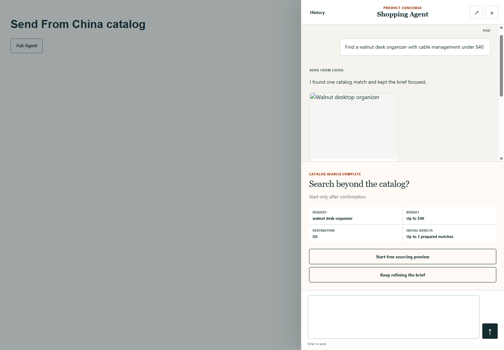
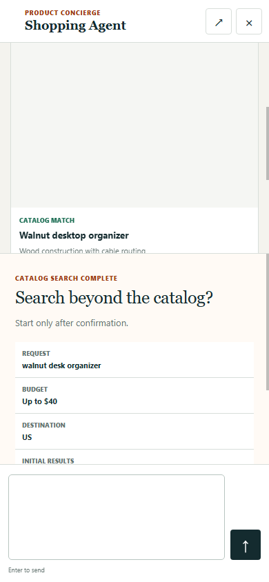

<div align="center">

# Send From China Reference Store

**A hybrid Shopify storefront where catalog shopping and an agent drawer share one honest customer journey.**

[](#project-status)
[](https://github.com/Peter-Fu-Collab/send-from-china-reference-store/actions/workflows/ci.yml)
[](shopify-theme)
[](.github/workflows/ci.yml)
[](LICENSE)


</div>

## Why this exists

Shopping-agent demos often replace the store with a chat box. This repository
shows a different pattern: customers can browse normal catalog, product, cart,
and account surfaces, then open a contextual agent without losing the page or
their shopping brief.

The code is a reference implementation. It contains no production credentials,
catalog export, customer records, order data, or merchant-specific theme
settings. Checkout remains Shopify-hosted, and customer or merchant writes must
be authorized by a compatible server.

## Experience at a glance

| Surface | Included behavior | Boundary |
| --- | --- | --- |
| Home | Catalog search and agent entry | Search is free and separate from custom sourcing |
| Search and collections | Governed result cards, honest loading/error states | No fabricated totals, facets, price, or availability |
| Product | Media, variants, quantity, shipping estimate, add to cart | Shopify owns variant and cart truth |
| Cart | Quantity, removal, shipping state, checkout handoff | Payment details never enter theme JavaScript |
| Agent drawer | Context-preserving chat, compact results, explicit sourcing confirmation | Write actions require a compatible authenticated API |
| Customer account | Workspace and order-tracking extensions | Shopify session tokens remain the identity boundary |

## Screens

<table>
  <tr>
    <td width="62%"></td>
    <td width="38%"></td>
  </tr>
</table>

## Repository map

```text
shopify-theme/             Storefront sections, layouts, snippets, assets, tests
shopify-customer-account/  Customer Account UI extensions and contract tests
docs/                      Architecture, development, deployment, and operations
scripts/                   Repository safety scanner
.github/                   CI, dependency updates, and review templates
```

## Quick start

Requirements: Node.js 22+, npm, a Shopify development store, and Shopify CLI
access for an app/theme you control.

### 1. Verify the customer-account app

```bash
cd shopify-customer-account
cp shopify.app.toml.example shopify.app.toml
npm ci
npm test
npm run check -- --no-color
```

The example config uses `example.invalid` and cannot deploy. Link an approved
development app with `shopify app config link` before running `npm run dev`.

### 2. Verify the theme

```bash
npx shopify theme check --path shopify-theme --fail-level error
node shopify-theme/tests/run-agent-drawer-browser-qa.mjs
```

The browser QA uses local fixtures and does not create a cart, checkout, order,
or payment.

### 3. Configure a compatible agent API

Set the theme's public API and shipping API settings in the Shopify editor. Do
not hard-code production hosts into the repository. A compatible service must
implement the response shapes documented in [Architecture](docs/ARCHITECTURE.md)
and enforce authentication, authorization, idempotency, and write policy on the
server.

## Design principles

- Commerce truth comes from Shopify or an explicitly named service response.
- The agent supplements catalog navigation; it does not conceal the store.
- Search, chat, sourcing, cart, and checkout are visibly distinct state changes.
- A missing price is “View current price,” never zero.
- A missing endpoint fails closed with a useful setup message.
- Desktop uses a drawer; mobile uses a full-height sheet with the same state.
- Keyboard focus, live status, reduced motion, and escape-to-close are tested.

## Project status

Current version: `0.1.0-rc.1`.

This is an open-source release candidate and integration reference, not a
turnkey copy of the hosted Send From China service. The paired
[`send-from-china-agent-core`](https://github.com/Peter-Fu-Collab/send-from-china-agent-core)
repository provides a small synthetic read-only API/MCP example. Production
sourcing, customer isolation, catalog writes, checkout completion, and payment
are deliberately outside that starter's capability.

## Documentation

- [Architecture and contracts](docs/ARCHITECTURE.md)
- [Development and verification](docs/DEVELOPMENT.md)
- [Deployment and rollback](docs/DEPLOYMENT.md)
- [Operations](docs/OPERATIONS.md)
- [Troubleshooting](docs/TROUBLESHOOTING.md)
- [Review evidence](docs/REVIEW_EVIDENCE.md)

## Security and license

Report vulnerabilities privately as described in [SECURITY.md](SECURITY.md).
Never attach credentials, customer data, production responses, or merchant
exports to an issue.

Licensed under the Apache License 2.0. See [LICENSE](LICENSE) and [NOTICE](NOTICE).
