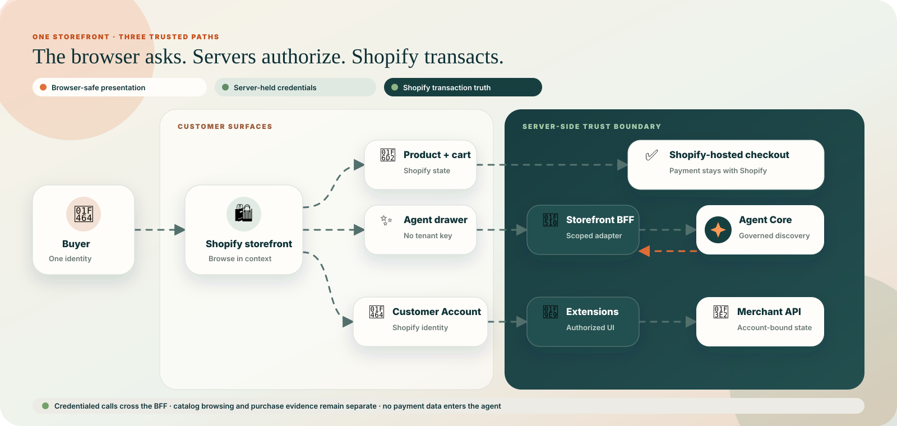

<div align="center">

# Send From China Reference Store 🛍️🤖

### A real Shopify storefront with an agent beside the shopping journey — not instead of it.

[](https://github.com/SuntekCorps-xLab/send-from-china-reference-store/releases/latest)
[](https://github.com/SuntekCorps-xLab/send-from-china-reference-store/actions/workflows/ci.yml)
[](shopify-theme)
[](storefront-bff)
[](LICENSE)

[🌐 Hosted synthetic demo](docs/HOSTED_SYNTHETIC_DEMO.md) · [⚡ 60-second local demo](#-see-it-in-60-seconds) · [🔌 Server-side BFF](storefront-bff/README.md) · [🧪 Demo + sandbox](docs/DEMO_AND_SANDBOX.md) · [🏗️ Architecture](#%EF%B8%8F-how-the-pieces-fit) · [🧠 Agent Core](https://github.com/SuntekCorps-xLab/send-from-china-agent-core) · [🔐 Security](SECURITY.md)



</div>

## 🚦 Start here: two honest paths

| Start | Best for | Boundary |
| --- | --- | --- |
| **[Try the hosted synthetic storefront](docs/HOSTED_SYNTHETIC_DEMO.md)** | A zero-account browser preview of the storefront, agent drawer, read-only run receipt, and failure states | Deterministic public fixtures only; no merchant, credential, purchase, shipping quote, or write. The public URL is added only after the exact candidate is deployed and reviewed. |
| **[Connect Shopify through the server-side BFF](storefront-bff/README.md)** | A merchant-owned Shopify development store or storefront integration | The browser calls a same-origin BFF; Shopify and Agent Core credentials remain server-side. Real connectivity is not claimed until the operator completes the documented 10/10 App Proxy gate. |

The hosted candidate and local demo render the same public assets and closed
synthetic contracts. If no reviewed hosted URL is listed in the
[hosted-demo guide](docs/HOSTED_SYNTHETIC_DEMO.md), run the exact experience
locally with `npm run demo`; that absence must never be presented as a Live
Shopify integration.

## ✨ Why this project exists

Most shopping-agent demos make the chat box the store. Real customers still
need to browse, compare, choose a variant, understand delivery, use a cart, and
reach a trusted checkout.

This repository shows a hybrid pattern:

- 🛒 **Shop normally** across catalog, search, product, cart, and account pages.
- 💬 **Ask in context** without losing the product or brief you were viewing.
- 🔎 **Search the catalog first** before offering custom sourcing.
- ✅ **Confirm every state change** instead of turning conversation into a hidden write.
- 🔐 **Keep credentials server-side** and payment inside Shopify.

It is the storefront companion to
[`send-from-china-agent-core`](https://github.com/SuntekCorps-xLab/send-from-china-agent-core),
which provides the agent-native catalog, quote, governance, and sourcing
contracts. This repository provides the customer experience built on top.

## ⚡ See it in 60 seconds

No Shopify account, API key, database, or cloud service is needed for the local
experience demo.

```bash
git clone https://github.com/SuntekCorps-xLab/send-from-china-reference-store.git
cd send-from-china-reference-store
npm ci
npm run verify
npm run demo
```

Open **http://127.0.0.1:4173**, click **Ask Agent**, and submit a request such as
`a practical desk gift under $40`.

`npm run verify` is the zero-account release check and now covers both the
drawer and customer-account workspace browser QA. With Agent Core checked out
beside this repository, `npm run verify:paired` also runs the versioned
[20-journey paired E2E release harness](evals/paired-v0/README.md). It records
the exact Git SHA of both checkouts and the dataset hash in a sanitized ignored
artifact. The paired check remains synthetic, blocks non-loopback network
requests, and makes no production or supported commerce write. Shopify CLI
checks remain documented in [`docs/DEVELOPMENT.md`](docs/DEVELOPMENT.md).

For an exact-SHA, three-repository synthetic contract projection, use the
[20-journey triad harness](evals/triad-v1/README.md). It checks compatible
result states across separately invoked Mini Suntek, Agent Core, and Reference
Store surfaces. It is deliberately marked `full_triad_e2e=false` and
`authorizes_release=false`: it is not evidence that Mini calls Core through
Reference Store, and it cannot activate Live Preview.

> [!NOTE]
> The local demo provides four deterministic synthetic scenarios: catalog
> match, terminal miss, clarification, and safe failure. It does not call a
> merchant, create a sourcing task, or perform a commerce write. The UI and
> `/api/status` display `synthetic_demo`; every card is labelled synthetic,
> illustrative, non-purchasable, and without a shipping rate.

### Demo and connected modes

| Mode | Data source | Credential | What it proves |
| --- | --- | --- | --- |
| Hosted synthetic storefront | Deterministic public fixtures in a deployment-disabled Worker candidate | None | The same responsive UI and closed read-only contracts without an account; not Shopify connectivity |
| Zero-account demo | Four deterministic local scenarios | None | Drawer states, responsive layout, sanitized contracts, and explicit truth labels |
| Connected local sandbox | Storefront demo BFF → local Agent Core sandbox | Short-lived local token stored only in the server process | The public repositories and guarded HTTP contract working together on synthetic data |
| Shopify development-store read-only | Storefront demo BFF → Agent Core Sandbox → Shopify Storefront API | Server environment or secret provider only | Published product, verified price, `availableForSale`, and same-store product URL truth; no writes or transaction claims |
| Production commerce | Merchant-owned Shopify and service adapters | Merchant-managed | Variants, cart, checkout, identity, and any real shipping integration |

Run `npm run demo:platform` with Agent Core checked out beside this repository
to start the connected local sandbox. See the
[Demo and Sandbox Guide](docs/DEMO_AND_SANDBOX.md) for mode boundaries,
scenario expectations, and bring-your-own runtime setup.

Run `npm run demo:shopify` only with a separately authorized development store.
It is an explicit read-only server mode and never silently falls back to
synthetic data. See the
[Shopify read-only sandbox guide](docs/SHOPIFY_READ_ONLY_SANDBOX.md).

The repository does not include a carrier-rate service. Any interface that
shows real freight must obtain package, origin, destination, and service-level
facts from a separately operated provider and must not relabel Agent Core's
catalog estimate as shipping.

## 📸 Experience at a glance

### Desktop — shop and ask side by side



The catalog remains visible while guidance arrives beside it. The browser sees
only the BFF response; the Agent Core tenant credential stays server-side.

### Mobile — the same context in one accessible sheet



The same state becomes a focused mobile sheet without turning the conversation
into checkout. Shopify still verifies variant, inventory, price, and cart.

## 🧭 Choose your path

| I want to… | Start here | What you need |
| --- | --- | --- |
| **Preview in a hosted browser surface** | [`hosted-demo/`](hosted-demo) + [`docs/HOSTED_SYNTHETIC_DEMO.md`](docs/HOSTED_SYNTHETIC_DEMO.md) | A reviewed deployment URL, or the documented local Worker preview |
| **Preview the UX** | `npm run demo` | Node.js 22+ |
| **Run the connected local sandbox** | `npm run demo:platform` + [`docs/DEMO_AND_SANDBOX.md`](docs/DEMO_AND_SANDBOX.md) | Both public repositories checked out locally |
| **Test both public repos together** | [`docs/PAIRED_LOCAL_QUICKSTART.md`](docs/PAIRED_LOCAL_QUICKSTART.md) | Node.js 22+; no hosted account |
| **Install the storefront** | [`shopify-theme/`](shopify-theme) | Shopify development store + CLI |
| **Connect live agent capabilities** | [`storefront-bff/`](storefront-bff) + [Agent Core](https://github.com/SuntekCorps-xLab/send-from-china-agent-core) | Cloudflare account or an equivalent BFF runtime |
| **Copy a minimal BFF integration** | [`starters/shopify-agent-bff/`](starters/shopify-agent-bff/README.md) | The paired local demo first; reviewed server credentials only for live use |
| **Add Shopify-native order tracking** | [`shopify-customer-account/`](shopify-customer-account) | Shopify app + Customer Account extensions |
| **Understand custom files quickly** | [`docs/CUSTOMIZATION_MAP.md`](docs/CUSTOMIZATION_MAP.md) | Five minutes |

> **Synthetic demo behavior:** local `npm run demo` responses from `/api/chat`
> and `/api/search` are deterministic fixtures selected by fixed scenarios and
> keyword routing; they do not use AI inference. Use the connected sandbox when
> validating real Agent Core integration behavior. The local search route is
> intentionally implemented so both chat and Search Contract v2 presentation
> can be tested without an account.

## 🏗️ How the pieces fit



The BFF is deliberate. Agent Core tenant credentials belong in a server secret
store, never in Liquid, JavaScript, theme settings, or browser requests. The
included Worker exposes only browser-safe `/api/chat`, `/api/search`, and
`/api/catalog` adapters.

[Read the complete contracts →](docs/ARCHITECTURE.md)

## 🧩 What is included

| Surface | Included behavior | Truth boundary |
| --- | --- | --- |
| 🏠 Home | Catalog search and agent entry | Search and custom sourcing remain distinct |
| 🔎 Search / collection | Governed result cards, empty/error states, pagination | No fabricated totals, price, or availability |
| 📦 Product | Media, variants, quantity, shipping estimate, cart action | Shopify owns variant and cart truth |
| 🛒 Cart | Quantity, removal, shipping state, checkout handoff | Theme never receives payment details |
| 💬 Agent drawer | Contextual chat, result cards, explicit sourcing confirmation | Credentialed calls pass through the BFF |
| 👤 Customer account | Installable order-tracking extension | Shopify Customer Account API is the source of truth |
| 🔌 Agent pages | Machine-readable discovery and MCP handoff | Agent Core exposes the current `/mcp` contract |

The `wp-account` and `wp-ask` directories are source-only adapter examples for
teams that already operate an authenticated merchant API. They have no active
Shopify extension manifest, are not included in the default app build, and do
not include their server implementation. See the
[Customer Account boundary](shopify-customer-account/README.md) before adapting
them.

## 🚀 Shopify quick start

### 1. Verify the theme

```bash
npx shopify theme check --path shopify-theme --fail-level error
node --test shopify-theme/tests/*.test.mjs
node shopify-theme/tests/run-agent-drawer-browser-qa.mjs
```

Push only to an unpublished development theme first:

```bash
shopify theme dev --path shopify-theme --store your-development-store.myshopify.com
```

### 2. Run the browser-safe Agent Core adapter

```bash
cd storefront-bff
cp .dev.vars.example .dev.vars
npm ci
npm test
npm run dev
```

Set `AGENT_CORE_TENANT_KEY` as a Worker secret and configure the non-secret
values in `wrangler.toml`. In the theme editor, set **Storefront agent proxy
URL** to this Worker — never to credentialed Agent Core directly.

### 3. Verify the Customer Account app

```bash
cd shopify-customer-account
cp shopify.app.toml.example shopify.app.toml
npm ci
npm test
npm run check -- --no-color
```

The checked-in config uses `example.invalid` and cannot deploy accidentally.
Link an app you control before running `npm run dev`.

## 🔐 Safety by construction

- No production credentials, product export, customer records, orders, or merchant settings.
- No Agent Core tenant key in theme code or browser traffic.
- No direct payment, checkout completion, catalog write, or management action.
- Missing price renders **View current price** — never zero.
- Demo cards and execution traces remain visibly marked `illustrative` and never claim a criteria match.
- Missing endpoints fail closed with a useful customer-facing state.
- Sourcing is a separate, explicit confirmation after bounded catalog search.
- CI runs contract tests, browser QA, dependency audit, and a repository safety scan.

## 🗺️ Repository map

```text
demo/                       Zero-account interactive experience preview
hosted-demo/                Deployment-disabled Worker wrapper for the same synthetic demo
storefront-bff/             Cloudflare Worker adapter; keeps Agent Core keys server-side
shopify-theme/              Installable storefront theme and browser/contract tests
shopify-customer-account/   Workspace and order-tracking UI extensions
docs/                       Architecture, setup, deployment, and operations
scripts/                    Public-repository credential and host scanner
.github/                    CI, dependency updates, and review templates
```

The complete Shopify theme contains upstream theme infrastructure. The product's
own interaction layer is concentrated in `lm-*`, `wp-*`, the BFF, and the
Customer Account extensions; use the
[customization map](docs/CUSTOMIZATION_MAP.md) instead of reading the repository
alphabetically.

## 🧪 Project status

Release candidate version: **`1.1.0`**. A stable version is not claimed until
the exact commit is tagged and the GitHub Release contains its verification
evidence.

This is an integration reference, not a copy of the hosted Send From China
service. The `1.1.x` candidate consumes Agent Core Search Contract `2.0`; use
the exact accepted Agent Core revision recorded by the paired release artifact,
not an unpinned branch name.
The included local paths use synthetic data and non-billable preview behavior.
Only the order-tracking Customer Account extension is installable by default;
the saved-workspace sources require a separately implemented merchant API.
Production customer isolation, durable sourcing, catalog publication, checkout
completion, and payment require merchant-owned services and policy.

## 📚 Documentation

- [Architecture and API contracts](docs/ARCHITECTURE.md)
- [Demo and connected local sandbox](docs/DEMO_AND_SANDBOX.md)
- [Hosted synthetic demo candidate](docs/HOSTED_SYNTHETIC_DEMO.md)
- [Release 1.1.0 candidate notes](docs/RELEASE_1_1_0.md)
- [Search Contract v2 mock/live quickstart](docs/SEARCH_CONTRACT_V2_INTEGRATION.md)
- [Hosted Platform integration](docs/HOSTED_PLATFORM_INTEGRATION.md)
- [Paired local Agent Core integration](docs/PAIRED_LOCAL_QUICKSTART.md)
- [Customization map](docs/CUSTOMIZATION_MAP.md)
- [Development and verification](docs/DEVELOPMENT.md)
- [Deployment and rollback](docs/DEPLOYMENT.md)
- [Operations](docs/OPERATIONS.md)
- [Troubleshooting](docs/TROUBLESHOOTING.md)
- [Review evidence](docs/REVIEW_EVIDENCE.md)
- [Public roadmap](ROADMAP.md)
- [Support boundaries](SUPPORT.md)
- [Compatibility matrix](docs/COMPATIBILITY.md)
- [Supply-chain and SBOM policy](docs/SUPPLY_CHAIN.md)

## ❓FAQ

<details>
<summary><strong>Is this another chat widget?</strong></summary>
No. The agent preserves the normal catalog and commerce journey. Chat is a
contextual decision surface, not a replacement storefront.
</details>

<details>
<summary><strong>Can the theme call Agent Core directly?</strong></summary>
Not when Agent Core requires a tenant credential. Use the included BFF so the
credential remains server-side and origins, payload size, and response shape
are controlled.
</details>

<details>
<summary><strong>Can the demo create carts, orders, or payments?</strong></summary>
No. The demo is intentionally synthetic. In a Shopify development store, cart
behavior uses Shopify; checkout and payment stay on Shopify-hosted surfaces.
</details>

## 📄 License

Apache License 2.0. See [LICENSE](LICENSE) and [NOTICE](NOTICE). Report security
issues privately using [SECURITY.md](SECURITY.md); never attach credentials,
customer data, or production responses to an issue. For setup, bugs, and
feature proposals, use the structured issue forms described in [SUPPORT.md](SUPPORT.md).
