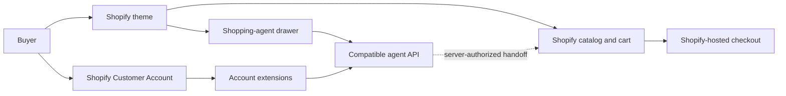

# Architecture and contracts

## Components

The theme owns presentation and local interaction state. Shopify remains the
source of truth for products, variants, cart lines, customer identity, and
checkout. The agent service may return discovery or sourcing results but must
not make a result purchasable unless the commerce system confirms it.

## Public agent response

The drawer expects JSON with an answer, optional session identifier, structured
criteria, zero or more results, and explicit next actions. Result cards may
contain a title, summary, reason, product URL, image URL, currency, price, and
availability. Missing price or availability remains unknown in the UI.

Operations must be explicit. A conversational refinement is not a sourcing
write, and a sourcing preview requires confirmation before creation.

## Account boundary

Customer Account extensions obtain identity through Shopify session tokens. A
compatible API must verify the token, bind all records to the authenticated
shop and customer subject, reject cross-customer identifiers, and apply durable
idempotency to every write.

## Configuration boundary

Store-specific API hosts, app identifiers, proxy routes, and theme settings are
deployment configuration. The checked-in examples are intentionally
non-deployable. Production secrets belong only in platform secret stores.

