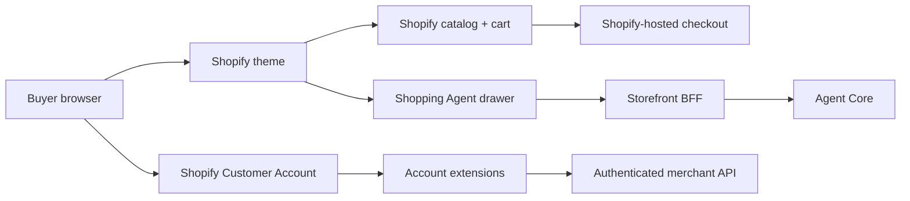

# Architecture and contracts

## Components



The theme owns presentation and local interaction state. Shopify remains the
source of truth for products, variants, cart lines, customer identity, and
checkout. Agent Core owns agent-native discovery and governed workflow
contracts. The BFF translates between them without exposing a tenant key.

## Why the BFF is required

Agent Core `0.4.0-rc.1` protects `/api/chat`, `/api/search`, and `/api/catalog`
with a tenant Bearer credential. A Shopify theme is public browser code, so it
cannot hold that credential.

`storefront-bff/` is a minimal Cloudflare Worker reference that:

- allows only configured browser origins;
- limits body size, message count, and result count;
- injects the Agent Core credential only in the server-to-server request;
- normalizes Agent Core products for the storefront cards;
- passes through `Retry-After` for rate limits;
- returns generic failures without upstream bodies, credentials, or stacks.

Equivalent merchant-controlled server runtimes may implement the same contract.

## Browser-safe endpoints

The theme setting `wp_governance_api_base` points to the BFF and retains its
identifier for backwards-compatible theme settings. Its customer-facing label
is **Storefront agent proxy URL**.

### `POST /api/chat`

The drawer sends a browser session identifier, the latest 12 messages,
structured criteria, an operation, cursor, and limit. It expects a reply,
optional result cards, criteria, cursor, and explicit next actions. See
`storefront-bff/test/worker.test.mjs` for a complete executable example.

Missing price or availability remains unknown in the UI. A result is never made
purchasable unless the commerce system confirms it.

### `POST /api/search` and `POST /api/catalog`

These return the compact storefront product shape used by the custom search and
`/collections/all` surfaces. Exposing catalog enumeration is an explicit tenant
choice; configure an Agent Core tenant with the appropriate read capability or
replace the BFF handler with a merchant-owned catalog service.

## Agent-native endpoint

The separate theme setting `wp_agent_core_api_base` is used only on
machine-readable agent pages. It links to Agent Core `/mcp`; it is never used by
the buyer's browser drawer to transmit a secret.

## Sourcing lifecycle contract

The catalog-first flow must reach a server-declared terminal miss before the UI
offers sourcing. Agent Core exposes bounded search, scoped access, idempotent
creation, task status, and paginated results. The expected lifecycle is:

```text
QUEUED -> SOURCING -> GOVERNING -> RESULTS_READY
```

`NO_MATCH`, `FAILED`, and `CANCELLED` are valid terminal states. A retry must
preserve its idempotency key; tasks must remain bound to the authenticated
customer; a sourcing result must not imply purchasability.

The public drawer offers a handoff only. Credentialed sourcing creation belongs
behind the authenticated account boundary, not the public BFF chat route.

## Account boundary

Customer Account extensions obtain identity through Shopify session tokens. A
compatible merchant API must verify the token, bind records to the shop and
customer subject, reject cross-customer identifiers, and apply durable
idempotency to every write.

## Configuration boundary

Store-specific hosts, app identifiers, proxy routes, and theme settings are
deployment configuration. Checked-in examples use `example.invalid` and are
intentionally non-deployable. Production secrets belong only in platform secret
stores.
